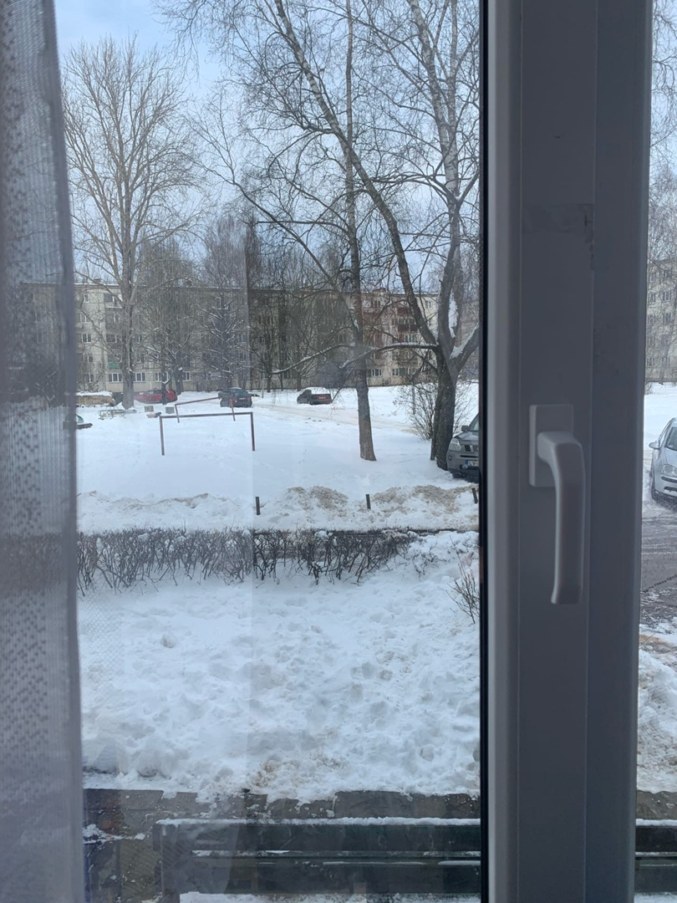

# CV_dzives_apraksts

# Citāts

*Veselā ķermenī - vesels prāts*

# Koda gabals

x = int(input('Ievadiet vērtību x'))
if x >= 10 :
print(x,' ir lielāks par 10')
else:
     print(x,' nav lielāks par 10')

# Bilde

[Mans rajons - Ķengarags](https://thumbs.dreamstime.com/b/%D0%B7%D0%B0%D1%85%D0%BE%D0%B4-%D1%81%D0%BE%D0%BB%D0%BD%D1%86%D0%B0-%D0%B2-%D1%80%D0%B8%D0%B3%D0%B5-latvija-%D0%B2%D0%B7%D0%B3%D0%BB%D1%8F%D0%B4-%D1%81%D0%B2%D0%B5%D1%80%D1%85%D1%83-%D0%BA-%D1%80%D0%B0%D0%B9%D0%BE%D0%BD%D1%83-kengarags-120490287.jpg)

# Saraksts

 - Matematika - 7
 - Angļu valoda - 7
 - Dabas zinības - 7
 - Datorsistēmas un datortīkli - 9
 - Fizika - 5
 - Informācijas un komunikācijas tehnoloģijas - 6
 - Krievu valoda - 9
 - Latviešu valoda - 6
 - Sports - 10

 # Tabula 